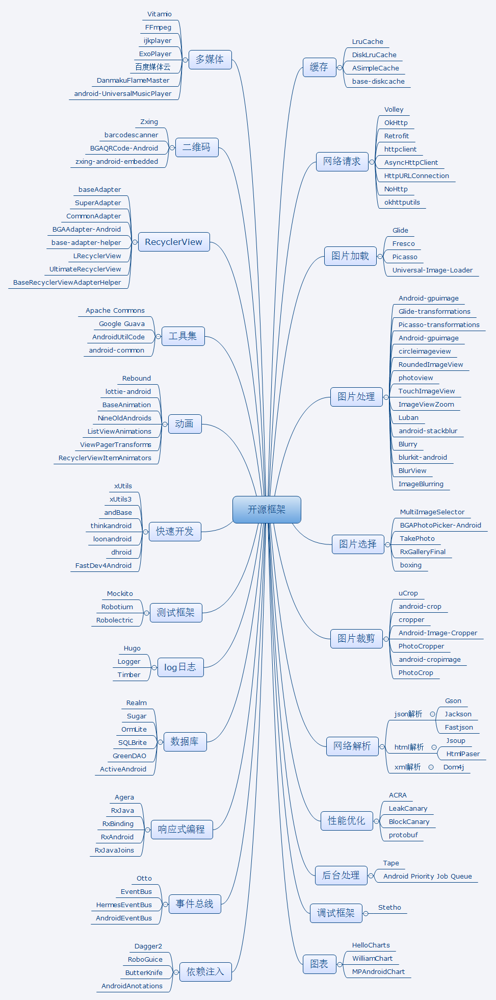

## Android开源框架系列

- [Android开源项目](http://blog.csdn.net/axi295309066/article/details/53857958)
- [Android开发常用开源框架2](http://blog.csdn.net/axi295309066/article/details/53763565)
- [Android开发常用开源框架3](http://blog.csdn.net/axi295309066/article/details/53783009)
- [2017年伊始，你需要尝试的25个Android第三方库](http://blog.csdn.net/axi295309066/article/details/56013369)
- [Android开发常用第三方平台](http://blog.csdn.net/axi295309066/article/details/52901991)
- [免费的计算机编程类中文书籍](https://github.com/justjavac/free-programming-books-zh_CN)
- [free-programming-books](https://github.com/vhf/free-programming-books)
- [Mark！Android最佳的开源库集锦](http://weibo.com/ttarticle/p/show?id=2309404039858120191334)
- [移动开发周刊：Android最佳的开源库集锦](http://weibo.com/ttarticle/p/show?id=2309404040295888065499)
- [GitHub Top 100的Android开源库](http://mp.weixin.qq.com/s?__biz=MzA4NTQwNDcyMA==&mid=402675429&idx=1&sn=ba3afd2069004b220eaa8a77fdecbaf7&scene=4#wechat_redirect)
- [Android 开源项目分类汇总](https://github.com/Trinea/android-open-project)
- [GitHub Android Libraries Top 100 简介](https://github.com/Freelander/Android_Data/blob/master/Android-Librarys-Top-100.md)
- [Android 学习资料收集](https://github.com/Freelander/Android_Data)
- [awesome-android-ui](https://github.com/wasabeef/awesome-android-ui)
- [Awesome-MaterialDesign](https://github.com/lightSky/Awesome-MaterialDesign)
- [awesome-android](https://snowdream.github.io/awesome-android/)
- [Andriod-collect-blogs](https://github.com/ZQiang94/Andriod-collect-blogs)
- [计算机常用基础算法](https://github.com/shijiebei2009/Algorithms)
- [阿里珍贵技术资料限时免费下载](https://zhuanlan.zhihu.com/p/25620810)

## 目录

* [Android开发常用框架](README.md)
* [android-open-project](android-open-project/android-open-project.md)
* [开源项目](company/company.md)
* [快速开发框架](快速开发/快速开发.md)
* [工具集](工具集/commons.md)
* [2017年伊始，你需要尝试的25个Android第三方库](android-open-project/2017年伊始，你需要尝试的25个Android第三方库.md)
* [第三方开发平台](开放平台/第三方开发平台.md)
* [混合开发](混合开发/混合开发.md)
* [图片处理](图片处理/图片处理.md)
* [网络请求](网络请求/net.md)
* [响应式编程](响应式编程/rx.md)
* [性能优化](性能优化/performance.md)
* [图表](图表/chart.md)
* [二维码](二维码/qrcode.md)
* [动画](动画/animation.md)
* [多媒体](多媒体/media.md)
* [缓存](缓存/cache.md)
* [事件总线](事件总线/eventbus.md)
* [数据库](数据库/database.md)
* [依赖注入](依赖注入/inject.md)
* [热修复](hotfix/hotfix.md)
* [Log日志](Log日志/logutils.md)
* [UI控件](UI控件/widget.md)
* [TextView](UI控件/TextView.md)
* [UI控件第1季](UI控件/demo1.md)
* [utils](utils/utils.md)
* [project](project/project.md)
* [后台处理](后台处理/后台处理.md)
* [Awesome-MaterialDesign](MaterialDesign/Awesome-MaterialDesign.md)

## Android开发常用开源项目

## 第三方开发平台

## 关注我

- Email：<815712739@qq.com>
- CSDN博客：[Allen Iverson](http://blog.csdn.net/axi295309066)
- 新浪微博：[AndroidDeveloper](http://weibo.com/u/1848214604?topnav=1&wvr=6&topsug=1&is_all=1)
- GitHub：[JackChan1999](https://github.com/JackChan1999)
- GitBook：[alleniverson](https://www.gitbook.com/@alleniverson)
- 个人博客：[JackChan](https://jackchan1999.github.io/)

如果觉得我的文章对您有用，请随意打赏。您的支持将鼓励我继续创作！

|                  微信赞赏支持                  |                 支付宝赞赏支持                  |
| :--------------------------------------: | :--------------------------------------: |
|  |  |
