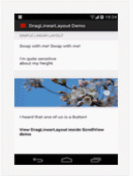
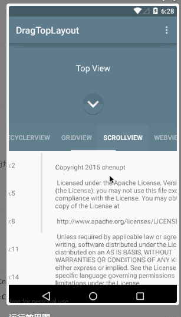
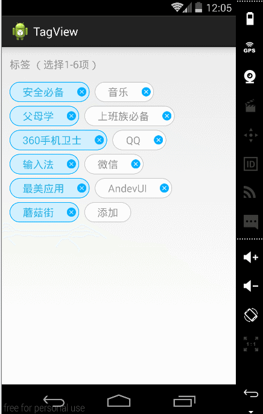
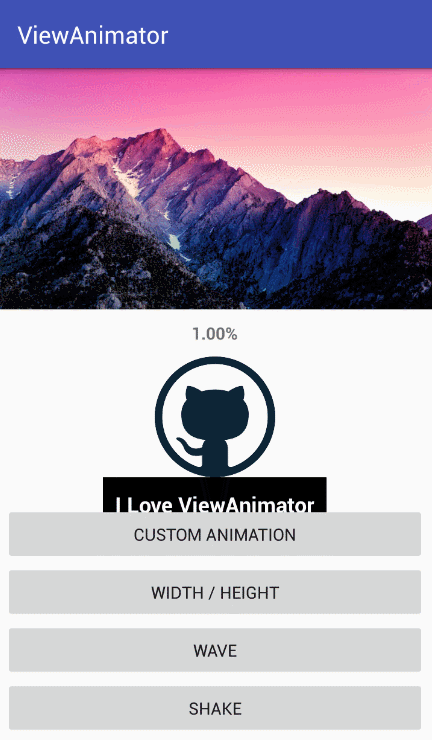
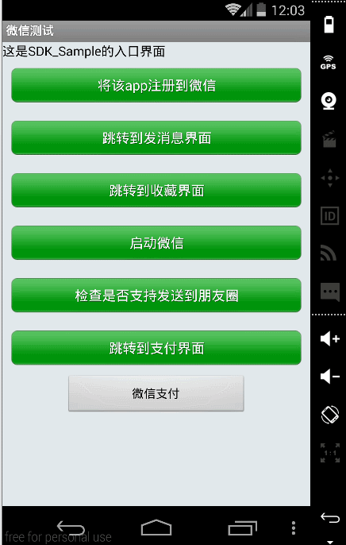
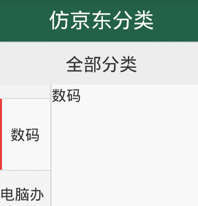
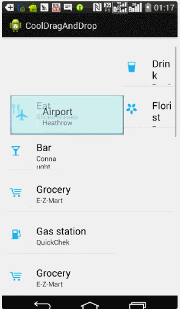
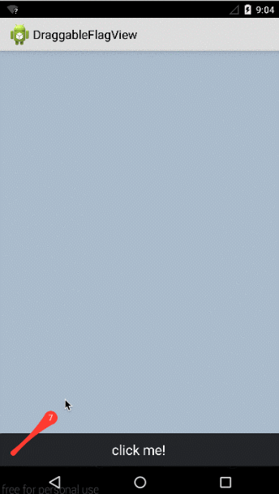

## 仿 Dribbble 的边栏菜单。

[下载链接：http://pan.baidu.com/s/1jHmH8r0](http://pan.baidu.com/s/1jHmH8r0)

## CalendarListview

实现每个月一行日历效果的ListView

[下载链接：http://pan.baidu.com/s/1bnVuRiZ](http://pan.baidu.com/s/1bnVuRiZ)

## 可以拖拽排序的LinearLayout

其实拖拽排序已经有很多ListView版本的实现，为什么还需要 LinearLayout里面拖拽排序呢？因为LinearLayout的使用比ListView简单，如果你只有几个Item，使用ListView是 不是太浪费？

[下载链接：http://pan.baidu.com/s/1pKezBlT](http://pan.baidu.com/s/1pKezBlT)

### 一个在ViewPager头部添加一个可以下拉的头部用以显示菜单的控件，类型豌豆荚的应用详情页实现。

[下载链接：http://pan.baidu.com/s/1OBl3C](http://pan.baidu.com/s/1OBl3C)

## ExtractWordView

一个可以提取单词的 ListView,支持"放大镜"效果。

[下载链接：http://pan.baidu.com/s/1mhqbrN6](http://pan.baidu.com/s/1mhqbrN6)

## FlyRefresh

支持 ListView, GridView, RecyclerView, ScrollView 的下拉刷新

[下载链接：http://pan.baidu.com/s/1boqtFyf](http://pan.baidu.com/s/1boqtFyf)

## Fontinator

是一个让使用自定义字体更方便的安卓库。 运行效果 使用说明： 1. 把字体添加到/assets/fonts 目录 2. 把此项目导入为Module 3. 在Application Gradle文件中添加compile project(':fontinator') 添加 xmlns:app到xml布局的根节点 xmlns:app="http://schemas.android.com/apk/res-auto" 工作原理 Fontinator继承了基于TextView的安卓控件，比如Button，注入一个Cached Fontface loader。 问题 安卓的布局编辑器无法预览自定义字体。 根据基于TextView的控件制作一个自定义控件 选择1: 就是继承 选择 2:使用TypefaceLoader和Typefaceable接口

[下载链接：http://pan.baidu.com/s/1dDNjrWl](http://pan.baidu.com/s/1dDNjrWl)

## 模仿大众点评的筛选框

[下载链接：http://pan.baidu.com/s/1eRecong](http://pan.baidu.com/s/1eRecong)

## PopupListView

实现ListItem 点击后置顶并可显示自定义添加的item內部View的ListView

[下载链接：http://pan.baidu.com/s/1nuyMJAp](http://pan.baidu.com/s/1nuyMJAp)

## 云标签删除，添加，漂亮的样式

[下载链接：http://pan.baidu.com/s/1boorDlP](http://pan.baidu.com/s/1boorDlP)

## 动画集合，可以用于自定义ProgressBar。

[下载链接：http://pan.baidu.com/s/1mhbiiZu](http://pan.baidu.com/s/1mhbiiZu)

## 通过代码的调用 跨过没有自己服务器的弊端 先测试是否可以跑通代码 与微信支付demo 绝对不一样

[下载链接：http://pan.baidu.com/s/1eQPiTzW](http://pan.baidu.com/s/1eQPiTzW)

### 可实现三级联动的选择器，高仿iOS的滚轮控件。

[下载链接：http://pan.baidu.com/s/1pJZGcVx](http://pan.baidu.com/s/1pJZGcVx)

### 仿美团等选择城市列表demo

[下载链接：http://pan.baidu.com/s/1pJWsjFH](http://pan.baidu.com/s/1pJWsjFH)

### 一个弹性效果的抽屉菜单，灵感来自一张概念图，实际效果实现了70%，总的来说还算可以。又是一次贝塞尔曲线的应用。

[下载链接：http://pan.baidu.com/s/1kTZissv](http://pan.baidu.com/s/1kTZissv)

### 这是一个用listview与fragment制作的三级分类demo，市面上非常常见

[下载链接：http://pan.baidu.com/s/1mgVcxOO](http://pan.baidu.com/s/1mgVcxOO)

### 一个与内容合二为一的ActionBar动画效果,让你的actionbar更生动。这种效果的好处是让actionbar也成为了内容的一部分，除了actionbar渐渐出现的效果外，背景图片还有一种称之为 Ken Burns effect 的动态效果。

[下载链接：http://pan.baidu.com/s/1bnSCOmr](http://pan.baidu.com/s/1bnSCOmr)

### 这一款自定义控件集成了开发中可能会使用到的各种自定义对话框，效果也极为绚丽

[下载链接：http://pan.baidu.com/s/1eRzaQwq](http://pan.baidu.com/s/1eRzaQwq)

### 这是一款实现数字动画递减的自定义控件

[下载链接：http://pan.baidu.com/s/1qX6hQES](http://pan.baidu.com/s/1qX6hQES)

### 这是一个自定义进度动画控件，很炫的动画效果

 

[下载地址：http://pan.baidu.com/s/1pJWYjwB](http://pan.baidu.com/s/1pJWYjwB)

### 在不规则列数的GridView上演示拖动排序效果，类似google keep

[下载链接：http://pan.baidu.com/s/1QDhpG](http://pan.baidu.com/s/1QDhpG)

### 可拖拽的红点，（仿新版QQ，tab下面拖拽标记为已读的效果），拖拽一定的距离可以消失回调。

[下载链接：http://pan.baidu.com/s/1o7fNCV4](http://pan.baidu.com/s/1o7fNCV4)

Android所有Demo一键下载请加QQ 1641907557 ，想与大神一起“涨姿势”请加群239292114，更多干货免费分享！
